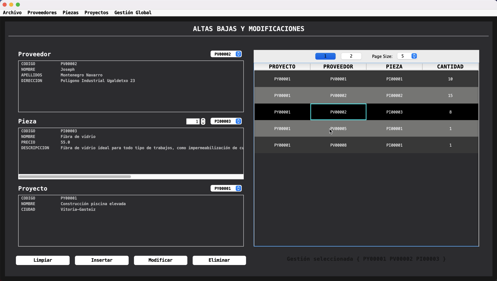

# Gestión de Proyectos

An academic project developed in Java designed to manage various aspects of a construction company, including project management, employee oversight, supplier coordination, and inventory management. The system leverages a MySQL database and Hibernate ORM for data persistence, and features a user-friendly interface built with Swing and SwingWorker for efficient, responsive operations

## Screenshots

